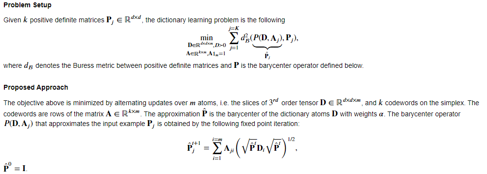
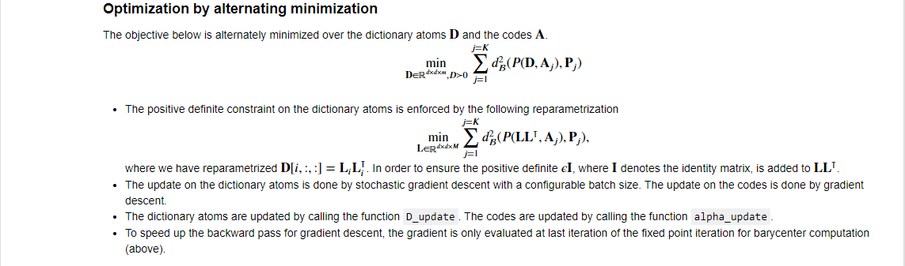
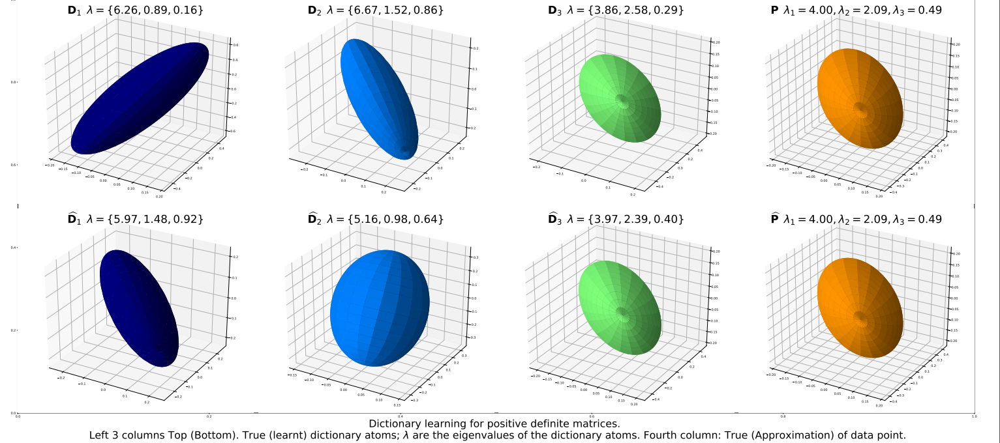

#  Barycentric dictionary learning problem setup

The problem setup is described below.

# Algorithm 
A description of the alernating minimization algorithm is below.

# Example
The example below represents an input data point a (3x3) positive definite matrix with eigenvalues lambda, top row 4th column, and its approximation.

# Code description
The code is a fully vectorized implementation of the algorithm above. For detailed description of function routine, please view the notebook .ipynb file.
